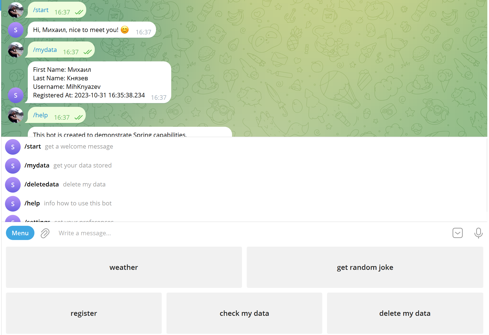
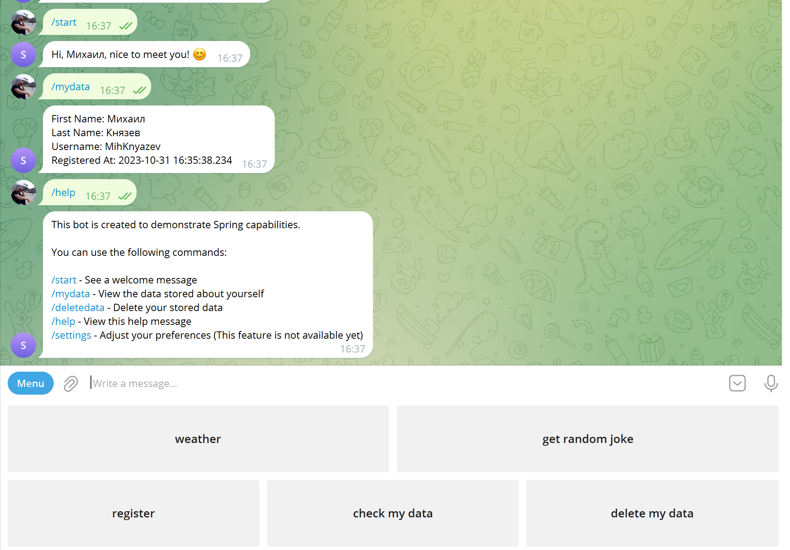

# SpringDemoBot - Telegram Bot

## Introduction
`SpringDemoBot` is a Telegram bot developed using the Spring Framework. This bot serves as my initial exploration into bot development, highlighting the basic capabilities of integrating with the Telegram API.

## Screenshots

### Main Interface

### Additional Interface

## Key Features
- Interaction with the Telegram API
- Basic command handling

## Technologies Used
This project was developed using:
- Spring Boot
- Telegram Bot API

## Conclusion
Creating this bot provided an opportunity to dive into the world of Java and Spring development and familiarize myself with the Telegram Bot API. Your attention is greatly appreciated. Please don't hesitate to reach out with any questions or feedback.
